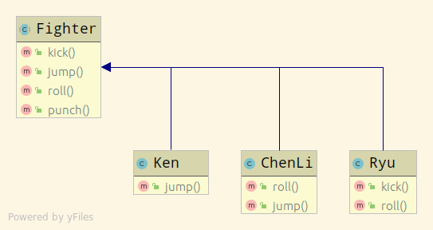
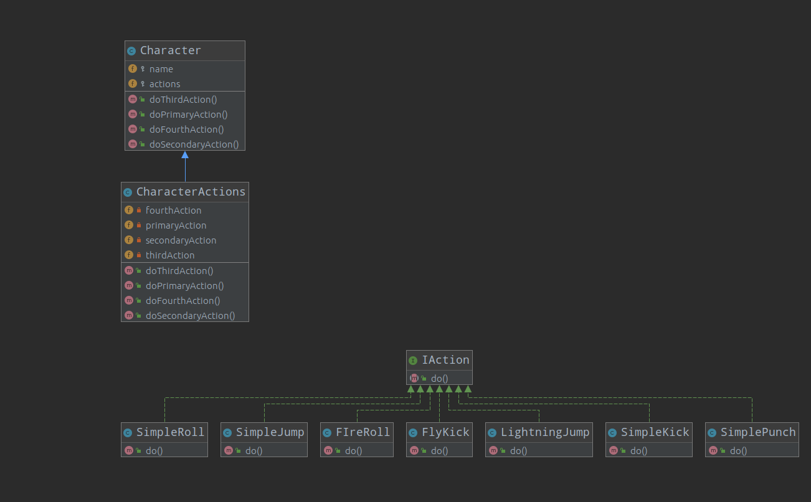

# strategy-patterns-exercises

Simple exercise to learn strategy pattern
I will try to explain my reasoning to reach the solution.

### Strategy 

I start analyzing the current architecture

The first problem i see, can appear if two child's of the Fighter class overrides the same method with the same behavior.
Because inheritance doesn't allow horizontal sharing between child's, we need to duplicate code.

To fix it, I can create an interface for each method of the Fighter Class.
But, because all has the same type, the best solution is create only one interface called Action.
This create a new problem, because all the actions haves the same type i can't distinguish between actions.
My solution to this is create a class that encapsulate all the character actions. 

I think that Fighter is too specific and can bee changed to Character.

Because the constructor of the Character Class was growing too much, I introduce a parameter object CharacterActions. 
This object wraps the character actions and with that only 2 parameters are needed.

The UML now looks like this
